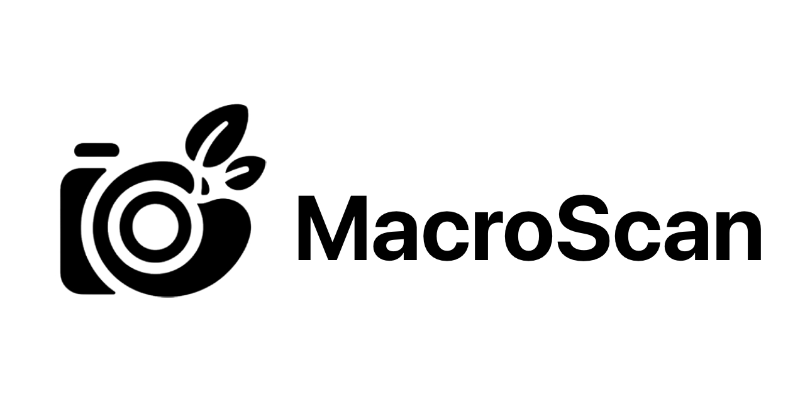

# MacroScan

<p align="center">
  
</p>

<p align="center">
  
</p>

MacroScan is a mobile nutrition-analysis app built with Expo and React Native. Users scan packaged foods or meals with the camera, run AI-assisted nutrition analysis, save results to history, and explore insight screens that turn past scans into trends and summaries.

## What This Project Contains

- A full Expo / React Native mobile app at the repository root
- Native iOS and Android projects under `ios/` and `android/`
- Camera-driven food scanning flows in `screens/FoodScanScreen.js` and related screens
- AI-backed nutrition and search providers under `screens/providers/`
- User history, profile, onboarding, and insights screens
- Firebase-backed auth wiring through `AuthContext.js` and `firebaseConfig.js`
- Jest test files under `__tests__/`
- A legacy Expo scaffold in `MacroScan/` that is retained for reference only and is not the active app

## How It Works

MacroScan combines a camera-first mobile UI with multiple AI-assisted nutrition workflows:

1. The user captures or selects a food image.
2. The app routes the scan through provider-specific logic in `screens/providers/`.
3. Results are rendered into scan, history, profile, and insights views.
4. Optional web-search-assisted flows use Brave Search for broader nutritional lookups.
5. Authenticated user flows depend on Firebase configuration supplied through environment variables.

From an evaluator’s perspective, the key implementation areas are:

- `App.js`: navigation structure and tab layout
- `screens/`: product flows, onboarding, history, insights, profile, and settings
- `screens/providers/`: AI provider integrations and search logic
- `__tests__/`: targeted unit and screen-level test coverage
- `ios/` and `android/`: native Expo-generated projects for platform builds

## Stack

- Expo SDK 51
- React Native 0.74
- React 18
- Firebase Auth
- Anthropic SDK
- Brave Search API
- Jest for test scaffolding

## Required Environment Variables

Create a local `.env` from the example template:

```bash
cp .env.example .env
```

Set these values before using auth or web-search-backed features:

- `EXPO_PUBLIC_FIREBASE_API_KEY`
- `EXPO_PUBLIC_FIREBASE_AUTH_DOMAIN`
- `EXPO_PUBLIC_FIREBASE_PROJECT_ID`
- `EXPO_PUBLIC_FIREBASE_STORAGE_BUCKET`
- `EXPO_PUBLIC_FIREBASE_MESSAGING_SENDER_ID`
- `EXPO_PUBLIC_FIREBASE_APP_ID`
- `EXPO_PUBLIC_BRAVE_SEARCH_API_KEY`

`firebaseConfig.js` now uses safe placeholders when these values are missing so the repository can clone and bundle without committed secrets, but live Firebase auth and Brave-powered search require real credentials.

## Run Locally

Install dependencies:

```bash
npm ci --legacy-peer-deps
```

Start the Expo development server:

```bash
npm run start
```

## Verified During Cleanup

The following commands were run successfully during the public-readiness cleanup:

```bash
npm ci --legacy-peer-deps
CI=1 npx expo start --offline
npx expo export --platform ios
```

`npx expo export --platform web` is not part of the supported path for this repository because the project does not declare Expo web dependencies.

## Notes for Evaluation

- The active app is the repository root, not the nested `MacroScan/` directory.
- Auth flows depend on Firebase values provided through `.env`.
- Search mode depends on a Brave Search API key.
- The repo includes public-readiness security files and monitoring setup (`SECURITY.md`, Dependabot, CodeQL).
- Local machine artifacts, cached Expo output, and committed secrets were removed during cleanup and rewritten out of Git history.

## Additional Reference

`README_VISUALIZATION.md` documents the visualization subsystem separately and remains in the repo as supporting material.
